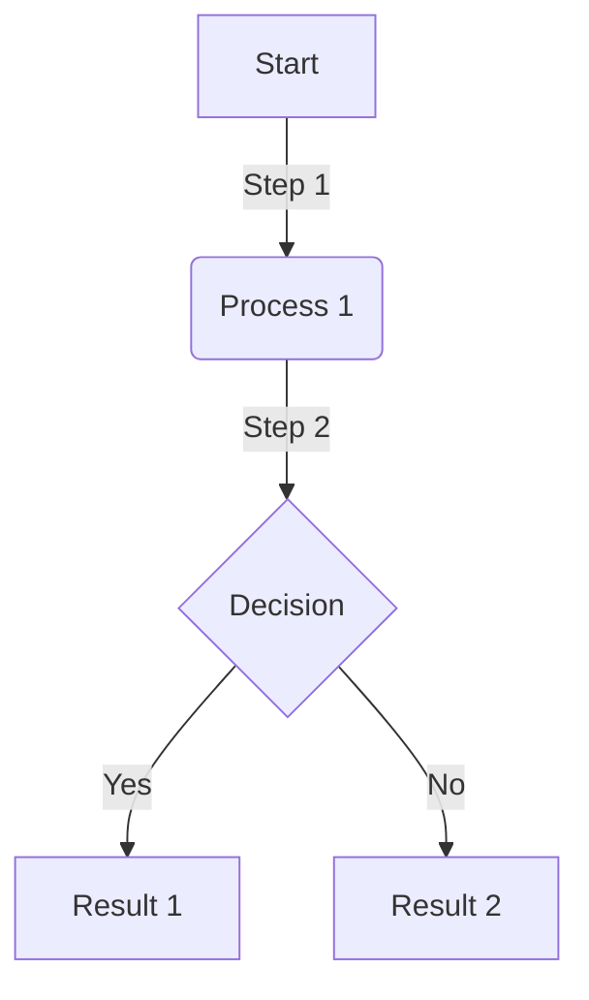

<!-- **Blog Title and Featured Image** -->


# 🚀 Blog Template

> **"What should a perfect blog post look like? Here are all the details!"**  

In this guide, you will find everything you need to **improve your blog post**:
- **SEO compatibility**
- **Code blocks and examples**
- **Images, videos, graphics**
- **Social media integration**
- **Surveys and comment section**

---

## 📌 **Table of Contents**
<details>
  <summary>📖 View All Contents</summary>

1. [🚀 Blog Introduction Section](#blog-introduction-section)
2. [🛠️ Technical Explanations](#technical-explanations)
3. [📜 Code Examples](#code-examples)
4. [🖼️ Images and Media](#images-and-media)
5. [📊 Graphics and Charts](#graphics-and-charts)
6. [🔗 Useful Resources](#useful-resources)
7. [🗳️ Survey and Polling](#survey-and-polling)
8. [💬 Comments and Feedback](#comments-and-feedback)
9. [📢 Social Media Sharing](#social-media-sharing)
10. [📌 Conclusion and Closing](#conclusion-and-closing)
11. [📄 Markdown Features and Tips](#markdown-features-and-tips)

</details>

---

## **Blog Introduction Section**
The **first 10 seconds** of your blog posts are the most critical!  
- **Explain what the reader will gain**
- **Use images and emojis to increase interest**  
- **Provide structure with bullet points** ✅  

---

## **Technical Explanations**
Let's explain the **features of Markdown and Docusaurus** as an example:

```md
## 📌 Quick Writing with Markdown
- **Bold Text** → `**Bold**`
- *Italic Text* → `*Italic*`
- `Code` → `` `Code` ``
```

---

## **Code Examples**
Here is a JavaScript code example:

```javascript
console.log("Hello Docusaurus!");
```

---

## **Images and Media**


---

## **Graphics and Charts**



---

## **Useful Resources**
- [Docusaurus Official Site](https://docusaurus.io)

---

## **Survey and Polling**
_Which is your favorite JavaScript framework?_  
- [ ] React
- [ ] Vue
- [ ] Angular
- [ ] Svelte

---

## **Comments and Feedback**
Please share your feedback about this post in the comments! 💬

---

## **Social Media Sharing**
You can help more people benefit by sharing this post! 🚀

🔗 **Share:** [Twitter](https://twitter.com) | [LinkedIn](https://linkedin.com) | [Reddit](https://reddit.com)

---

## **Conclusion and Closing**
In this post, we examined everything you need to **make your blog posts more engaging**. See you in the next post! 🎉

---

## **Markdown Features and Tips**

### 1. **Blockquotes**
Blockquotes can be used to highlight important information.

```markdown
> This is a blockquote. It is used to highlight important information.
```

### 2. **Lists**
Ordered and unordered lists can be used to present information in a structured manner.

#### Unordered List
```markdown
- Item 1
- Item 2
  - Subitem 1
  - Subitem 2
```

- Item 1
- Item 2
  - Subitem 1
  - Subitem 2

#### Ordered List
```markdown
1. First item
2. Second item
   1. Subitem 1
   2. Subitem 2
```

1. First item
2. Second item
   1. Subitem 1
   2. Subitem 2

### 3. **Code Blocks**
Code blocks can be used to highlight code examples.

```javascript
console.log("Hello, world!");
```

### 4. **Tables**
Tables can be used to present data in a structured manner.

```markdown
| Header 1 | Header 2 |
|----------|----------|
| Row 1    | Data 1   |
| Row 2    | Data 2   |
```

| Header 1 | Header 2 |
|----------|----------|
| Row 1    | Data 1   |
| Row 2    | Data 2   |

### 5. **Links**
Links can be used to direct to other pages or resources.

```markdown
[Google](https://www.google.com)
```
[Google](https://www.google.com)

### 6. **Images**
Images can be used to add visual content.

```markdown

```


### 7. **Horizontal Rules**
Horizontal rules can be used to separate sections.

```markdown
---
```

### 8. **Task Lists**
Task lists can be used to show to-do items.

```markdown
- [x] Task 1
- [ ] Task 2
- [ ] Task 3
```

- [x] Task 1
- [ ] Task 2
- [ ] Task 3

### 9. **Footnotes**
Footnotes can be used to provide additional information.

```markdown
Here is a simple footnote[^1].

[^1]: This is the footnote.
```

Here is a simple footnote[^1].

[^1]: This is the footnote.

### 10. **Embedded HTML**
You can use HTML within Markdown for more complex formatting.

```markdown
<div style={{color: 'red'}}>
This is a red text.
</div>
```

<div style={{color: 'red'}}>
This is a red text.
</div>

### 11. **Mathematical Expressions**
Mathematical expressions can be added using LaTeX or MathJax.

```markdown
$$
E = mc^2
$$
```

### 12. **Special Symbols and Emojis**
Special symbols and emojis can make the content more engaging.

- **🚀** → `:rocket:`
- **⭐** → `:star:`
- **📅** → `:calendar:` ...

### 13. **Embedded Videos**
You can embed videos directly in your Markdown file.

```markdown
<iframe width="560" height="315" src="https://www.youtube.com/embed/5dHLgHLUup8" frameborder="0" allowfullscreen></iframe>
```

<iframe width="560" height="315" src="https://www.youtube.com/embed/5dHLgHLUup8" frameborder="0" allowfullscreen></iframe>

### 14. **Containers**
Containers can be used to add special styles or functionality.

```markdown
:::tip
This is a tip.
:::

::: warning
This is a warning.
:::

::: danger
This is a dangerous warning.
:::
```

:::tip
This is a tip.
:::
:::warning
This is a warning.
:::
:::danger
This is a dangerous warning.
:::


